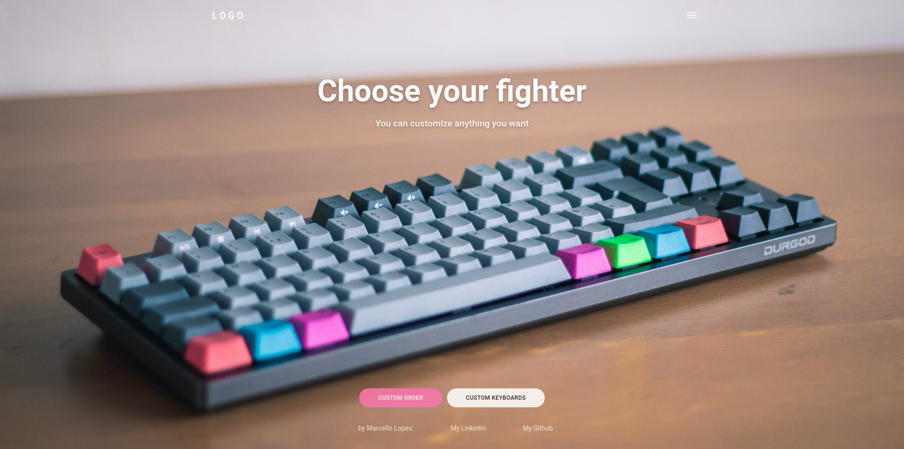

### By [Marcello Lopes](https://www.linkedin.com/in/marcellolopes30/)

# Customizable Home Page (w/ React and Typecript)

## Mobile first Home Page with scroll up/down sections fully and easy customizable.

This project was inspired by TESLA home page. I found the scroll behavior good in mobile devices and applied as a template/boilerplate. You can change the images, colors, texts, with ease.

Esse projeto foi inspirado pela home page da TESLA. Eu achei o comportamento do scroll ótimo para dispositivos mobile e apliquei como se fosse um template/boilerplate. Você pode mudar as imagens, cores e textos com facilidade.

## Tech Stack:

<ul>
<li> React </li>
<li> Typescript </li>
<li> Styled-Components </li>
<li> Framer-Motion </li>
</ul>

## Social Links:

[Twitter](https://twitter.com/marcell0lopes)
 
[LinkedIn](https://www.linkedin.com/in/marcellolopes30/)
 
[Dev.to](https://dev.to/marcell0lopes)
 
[RocketSeat Profile](https://app.rocketseat.com.br/me/marcello-lopes-03897)
